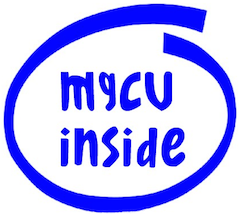

# mgcvUtils 

<!-- badges: start -->
<!-- badges: end -->

`mgcvUtils` is a collection of additional utilities to make working with `mgcv` easier.

# Funding

Various parts of the software have been funded under other projects and we would like to thank those funders for their contribution to open source science.

- Work on the implementation of the SPDE approximation for Matern covariance (`smooth.construct.spde.smooth.spec`) was funded by OPNAV N45 and the SURTASS LFA Settlement Agreement, and being managed by the US Navy's Living Marine Resources program under Contract No. N39430-17-C-1982.
- Work on censored log-normal helpers `clognorm` and `fitted_values_clognorm` were funded by the Department of Environment, Food and Rural Affairs, Natural Capital Ecosystem Assessment Programme. It was managed by the Environment Agency and delivered by the UK Centre for Ecology and Hydrology, under Research, Development and Evidence Framework contract RDE945.

